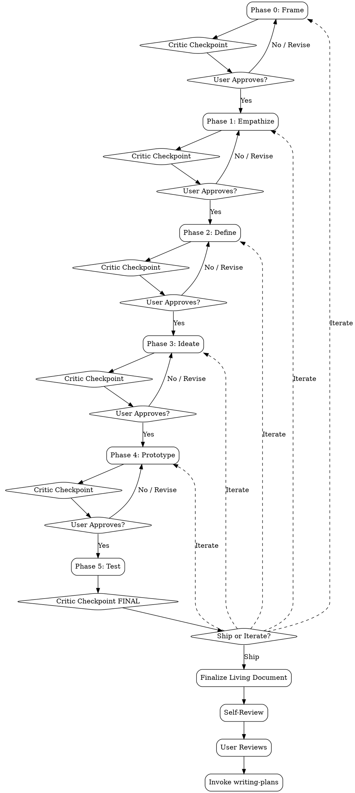

# Design Thinking

A structured design thinking orchestrator based on the Stanford d.school framework. Guides the user through six phases — Frame, Empathize, Define, Ideate, Prototype, and Test — using simulated user personas and parallel creative subagents to produce a validated, implementation-ready design.

> **HARD-GATE:** Do NOT begin any implementation (writing code, building systems, creating deliverables beyond prototypes) until Phase 5: Test has been completed AND the user has explicitly approved the final design. This gate is non-negotiable. If the user asks to skip ahead to implementation, remind them of this rule and offer to accelerate through remaining phases instead.

---

## Quick Reference

| Phase | Name | What Happens | Subagents Used |
|-------|------|-------------|----------------|
| 0 | Frame | Scope the problem, classify type, propose personas, initialize living document | Critic |
| 1 | Empathize | Simulate persona interviews in parallel, synthesize empathy map | Persona-Interviewer (x3-5), Critic |
| 2 | Define | Craft POV statements, HMW questions, design principles | Critic |
| 3 | Ideate | Parallel creative exploration via three lenses, shortlist ideas | Creative-Lens (x3), Critic |
| 4 | Prototype | Build low-fidelity prototype appropriate to problem type | Prototype-Builder, Critic |
| 5 | Test | Simulate persona usability tests, final adversarial review, hand off | Persona-Tester (x4-7), Critic |

---

## When to Use

- Product design (UI/UX, features, new products)
- System or process design (workflows, architectures, internal tools)
- Business strategy (new markets, business models, value propositions)
- Any problem where the user needs to deeply understand end-user needs before building
- When the user says "I have an idea but I'm not sure how to approach it"

## When NOT to Use

- Pure implementation tasks where the design is already decided ("build me a REST API with these endpoints")
- Bug fixes or debugging
- Code refactoring with clear technical scope
- Tasks that are purely technical with no user-facing design decisions
- When the user explicitly asks to skip design and go straight to building

---

## Orchestrator Flow

---

## Phase 0: Frame

**Mode:** Orchestrator only (no subagents except Critic)

This phase establishes the problem space, classifies the challenge, and sets up the personas and living document that will carry through the entire process.

### Step 1: Understand the Problem

Ask scoping questions **ONE AT A TIME** — ask one question, wait for the user's response, then decide what to ask next based on their answer. Do not present a list of questions.

Start with: *"What's the problem space? Who is affected?"*

Based on the response, follow up with one of these (or adapt):
- *"What do you already know or have tried?"*
- *"What would success look like?"*

Skip questions the user has already answered in their initial prompt. 2-3 questions total is typical.

### Step 2: Classify and Scope

Based on the user's answers, determine three classification dimensions:

1. **Problem Type** — one of:
   - `product-ui` — a user-facing product, feature, or interface
   - `system-process` — a workflow, architecture, internal tool, or operational process
   - `business-strategy` — a market, business model, go-to-market, or value proposition challenge

2. **Starting Point** — one of:
   - `vague` — the user has a general area but no specific solution in mind
   - `defined` — the user has a specific idea and wants to validate or improve it

3. **Prototype Mode** — one of:
   - `visual` — HTML/CSS mockup (default for `product-ui`)
   - `text` — Mermaid diagrams, narrative descriptions, canvases (default for `system-process` and `business-strategy`)

Present the classification to the user and confirm before proceeding.

### Step 3: Propose Personas

Generate 3-5 diverse simulated user personas. For each persona, provide:

- **Name** — a realistic name
- **Background** — age, occupation, relevant life context (1-2 sentences)
- **Relationship to Problem** — how they encounter or are affected by the problem
- **Tech Literacy** — low / medium / high
- **Key Frustrations** — 2-3 specific pain points related to the problem space
- **Goals** — what success looks like for this persona

**Diversity requirement:** Deliberately vary personas across age, technical ability, use frequency, accessibility needs, and attitude toward the problem. Include at least one skeptic or reluctant user.

Present personas to the user. They may add, remove, or modify personas before proceeding.

### Step 4: Initialize Living Document

Create the living design document at `docs/design-thinking/<topic-slug>/design-document.md` using the template from `templates/design-document.md`. The topic slug should be a kebab-case version of the problem summary.

Initialize the document with:
- Problem statement (from Step 1)
- Classification (from Step 2)
- Persona roster (from Step 3)
- Phase 0 status: COMPLETE

This document is the **single source of truth** for the entire design thinking process. Every phase will append to it.

### Step 5: Critic Checkpoint

Dispatch the Critic subagent using the prompt from `prompts/critic.md`. Provide the critic with:
- The full framing (problem statement, classification, constraints)
- The persona roster
- Instruction to research existing solutions and competitors in this space

The critic will return one of: **PASS**, **CAUTION**, or **CHALLENGE**.

- **PASS** — proceed to user approval
- **CAUTION** — present concerns to user alongside approval request
- **CHALLENGE** — present the challenge; user must address it before proceeding

### Wait for User Approval

Present a summary of Phase 0 outputs and ask: "Ready to move to Phase 1: Empathize? Or would you like to revise anything?"

---

## Phase 1: Empathize

**Mode:** Orchestrator + Persona-Interviewer subagents

This phase simulates in-depth user research by having subagents role-play as each persona.

### Step 1: Dispatch Persona-Interviewer Subagents

Launch 3-5 persona-interviewer subagents **in parallel** (one per persona) using the prompt from `prompts/persona-interviewer.md`. Provide each subagent with:

- The full persona profile (from Phase 0)
- The problem statement
- The content of `reference/empathy-techniques.md` (include the full text inline in the subagent prompt — do not reference the file path)

Each subagent will conduct a simulated interview from the persona's perspective, exploring:
- Current pain points and workarounds
- Emotional responses to the problem
- Unmet needs and latent desires
- Context of use (when, where, how they encounter the problem)

### Step 2: Synthesize

After all subagents return, synthesize their findings into:

1. **Common Themes** — needs and frustrations that appear across multiple personas
2. **Divergent Needs** — where personas disagree or have conflicting requirements
3. **Riskiest Assumptions** — beliefs about users that have the least evidence
4. **Empathy Map** — a consolidated Says / Thinks / Does / Feels grid

Present the synthesis to the user. The user may ask follow-up questions to specific personas — if so, re-dispatch the relevant persona-interviewer subagent with the follow-up question appended to the original prompt.

### Step 3: Critic Checkpoint

Dispatch the Critic with the full empathy synthesis. Instruct the critic to:
- Check for **confirmation bias** — are the personas just telling us what we want to hear?
- Research **real-world user complaints** — what do actual users say in forums, reviews, and social media about similar problems?
- Identify any **missing perspectives** not covered by current personas

### Step 4: Update Living Document

Append to the living document:
- Full empathy synthesis (themes, divergent needs, assumptions, empathy map)
- Critic findings and any adjustments made
- Phase 1 status: COMPLETE

### Wait for User Approval

Present the empathy findings and ask: "Ready to move to Phase 2: Define? Or would you like to explore any persona's perspective further?"

---

## Phase 2: Define

**Mode:** Orchestrator only (convergent thinking — no subagents except Critic)

This phase converges the empathy findings into a clear problem definition.

### Step 1: POV Statement

Craft a Point of View statement in the d.school format:

> **[User]** needs **[need]** because **[insight]**.

Propose 2-3 variations of the POV statement, each emphasizing a different facet of the problem. Explain the trade-offs between them. Ask the user to select or refine one as the primary POV.

### Step 2: How Might We (HMW) Questions

Generate 5-7 "How Might We" questions derived from the POV statement and empathy findings. Rank them by potential impact (high / medium / low). Example format:

- **HMW** make [action] feel [emotion] for [persona type]? — **Impact: High**

### Step 3: Design Principles

Extract 3-5 design principles that will guide ideation and prototyping. Each principle must include:

- **Principle name** — a short memorable phrase
- **Description** — one sentence explaining the principle
- **Traceability** — which persona evidence supports this principle (reference specific persona quotes or behaviors from Phase 1)

### Step 4: Coherence Check

Before calling the critic, perform a self-check:
- Does the POV statement align with the strongest empathy themes?
- Do the HMW questions flow logically from the POV?
- Are the design principles grounded in actual persona evidence, not assumptions?

Flag any inconsistencies and resolve them.

### Step 5: Critic Checkpoint

Dispatch the Critic with the full Define output. Instruct the critic to:
- **Challenge the POV** — is it too broad, too narrow, or based on weak evidence?
- **Check HMW questions against existing solutions** — are any of these already well-solved by competitors?
- Suggest any missing HMW questions or design principles

### Step 6: Update Living Document

Append to the living document:
- Selected POV statement (and runner-ups)
- Ranked HMW questions
- Design principles with traceability
- Critic findings
- Phase 2 status: COMPLETE

### Wait for User Approval

Present the Define outputs and ask: "Ready to move to Phase 3: Ideate? Or would you like to refine the problem definition?"

---

## Phase 3: Ideate

**Mode:** Orchestrator + Creative-Lens subagents

This phase generates a wide range of ideas through three distinct creative lenses, then converges on the most promising ones.

### Step 1: Dispatch Creative-Lens Subagents

Launch 3 creative-lens subagents **in parallel** using the prompt from `prompts/creative-lens.md`. Each subagent receives a different `lens_type`:

1. **`analogous`** — draws inspiration from analogous domains (e.g., "How does [unrelated industry] solve a similar problem?")
2. **`first-principles`** — strips the problem to fundamentals and rebuilds from scratch
3. **`10x-radical`** — imagines a solution with 10x the ambition, no constraints

Provide each subagent with:
- The selected POV statement
- The ranked HMW questions
- The design principles
- The empathy synthesis summary
- The content of `reference/ideation-techniques.md` (include the full text inline — do not reference the file path)

Each subagent will generate 5-8 ideas within their lens, with a brief rationale for each.

### Step 2: Synthesize

After all subagents return, synthesize their ideas:

1. **Group** ideas by theme or approach
2. **Highlight convergences** — ideas that appeared independently across multiple lenses
3. **Highlight eureka moments** — ideas that are genuinely novel or unexpected
4. **Propose a shortlist of 3-5** most promising ideas, with a brief case for each

Present the full idea landscape and the shortlist to the user. Ask the user to **select 1-2 ideas** to carry forward into prototyping.

### Step 3: Critic Checkpoint

Dispatch the Critic with the idea shortlist and the user's selection. Instruct the critic to:
- **Poke holes** in each selected idea — what could go wrong? What assumptions are untested?
- **Competitive analysis** — do any existing products already do this? How is this different?
- Suggest any modifications to strengthen the selected ideas

### Step 4: Update Living Document

Append to the living document:
- Full idea landscape (grouped by lens)
- Shortlist with rationale
- User's selection
- Critic analysis
- Phase 3 status: COMPLETE

### Wait for User Approval

Present the selected ideas with critic feedback and ask: "Ready to move to Phase 4: Prototype? Or would you like to iterate on the ideas?"

---

## Phase 4: Prototype

**Mode:** Orchestrator + Prototype-Builder subagent

This phase creates a low-fidelity prototype of the selected idea(s), appropriate to the problem type.

### Step 1: Determine Approach

Based on the problem type classified in Phase 0:

- **`product-ui`** → HTML/CSS mockup with inline styles. Interactive enough to convey the user flow. No JavaScript frameworks — plain HTML that can be opened in a browser.
- **`system-process`** → Mermaid diagrams (flowcharts, sequence diagrams) + written process descriptions. Include system boundaries, actors, and key decision points.
- **`business-strategy`** → Narrative walkthrough + Business Model Canvas (Key Partners, Key Activities, Key Resources, Value Propositions, Customer Relationships, Channels, Customer Segments, Cost Structure, Revenue Streams).

Present the planned approach to the user and confirm before building.

### Step 2: Dispatch Prototype-Builder

Launch the prototype-builder subagent using the prompt from `prompts/prototype-builder.md`. Provide:

- The selected concept(s) from Phase 3
- The design principles from Phase 2
- The full persona profiles from Phase 0
- The problem type and prototype mode
- Any specific requirements or constraints the user has mentioned

The subagent will produce the prototype artifacts (HTML files, Mermaid diagrams, canvas documents, etc.) and save them alongside the living document.

### Step 3: Present Prototype

Present the prototype to the user. Explain what it demonstrates and what it intentionally leaves out (it is low-fidelity — set expectations).

The user may request iterations on the prototype. If so, re-dispatch the prototype-builder with the user's feedback appended to the original prompt. Iterate until the user is satisfied or chooses to proceed.

### Step 4: Critic Checkpoint

Dispatch the Critic with the prototype and the design principles. Instruct the critic to:
- **Challenge assumptions** embedded in the prototype — what user behaviors does it assume?
- **Compare to existing solutions' interactions** — does the prototype offer a meaningfully better experience?
- Identify any **accessibility or inclusivity concerns**
- Flag any **design principle violations**

### Step 5: Update Living Document

Append to the living document:
- Prototype approach and rationale
- Links to prototype artifacts
- Iteration history (if any)
- Critic findings
- Phase 4 status: COMPLETE

### Wait for User Approval

Present the prototype with critic feedback and ask: "Ready to move to Phase 5: Test? Or would you like to iterate on the prototype?"

---

## Phase 5: Test

**Mode:** Orchestrator + Persona-Tester subagents

This is the final validation phase. Simulated personas test the prototype, and the critic delivers a final adversarial review.

### Step 1: Assemble Test Roster

Recall the original personas from Phase 0. Then generate 1-2 **edge-case personas** — users with unusual needs, extreme use cases, or accessibility requirements not covered by the original roster.

Present the full test roster (original + edge-case personas) to the user and wait for approval before proceeding.

### Step 2: Dispatch Persona-Tester Subagents

Launch all persona-tester subagents **in parallel** (one per persona, including edge-case personas) using the prompt from `prompts/persona-tester.md`. Provide each subagent with:

- The full persona profile
- The prototype (or a detailed description of it)
- The riskiest assumptions from Phase 1
- Specific testing questions (derived from HMW questions and design principles)
- The design principles from Phase 2

Each subagent will simulate the persona interacting with the prototype and report:
- What worked well
- What was confusing or frustrating
- Whether their core needs are met
- Suggestions for improvement
- A satisfaction score (1-5) with explanation

### Step 3: Synthesize Test Results

After all subagents return, synthesize into:

1. **Validation Summary** — which assumptions were validated, which were challenged
2. **Critical Issues** — problems that would prevent adoption or cause significant frustration (severity: critical / major / minor)
3. **Iteration Recommendations** — specific, prioritized changes ranked by impact and effort

### Step 4: Critic Checkpoint FINAL

Dispatch the Critic for a **full adversarial review**. This is the most thorough critic pass. Instruct the critic to:

- **Re-research the competitive landscape** — has anything changed since Phase 0? Any new entrants or features?
- **Synthesize all critic findings from Phases 0-4** into a cumulative assessment
- Present the **"strongest case against shipping"** — the most compelling argument for why this design should NOT move to implementation
- Deliver a final verdict: PASS / CAUTION / CHALLENGE

### Step 5: User Decision

Present the test results, iteration recommendations, and final critic review. Ask the user:

- **"Ship"** → proceed to Step 6 (Finalize and Hand Off)
- **"Iterate"** → the user chooses which phase to loop back to (Phase 0, 1, 2, 3, or 4). Preserve all existing artifacts — append new iterations, do not overwrite previous work.

### Step 6: Finalize and Hand Off

1. **Finalize the Living Document:**
   - Ensure all phases are marked COMPLETE
   - Add a final "Decision" section recording the user's ship decision
   - Add a "Next Steps" section with implementation recommendations

2. **Self-Review:** Before handing off, perform a self-check:
   - **Placeholder scan** — search the document for any TODO, TBD, placeholder, or incomplete sections
   - **Consistency check** — do personas, design principles, and prototype align?
   - **Scope check** — does the final design match the original problem scope, or has it drifted?
   - **Ambiguity check** — would a developer be able to implement this without guessing?

   Fix any issues found during self-review.

3. **User Reviews:** Present the finalized living document to the user for a final review. Address any feedback.

4. **Invoke writing-plans:** Once the user approves the final document, invoke the `writing-plans` skill to generate an implementation plan from the design document.

---

## Key Rules

1. **No implementation before Test approval (HARD-GATE).** Do not write production code, create production infrastructure, or build final deliverables until Phase 5 has been completed and the user has explicitly approved. Prototypes in Phase 4 are the only exception — they are intentionally low-fidelity and disposable.

2. **One question at a time in Phase 0.** When scoping the problem, ask each question individually and wait for the user's response. Do not present a list of questions.

3. **User gate between every phase.** Never advance to the next phase without explicit user approval. Present a clear summary of the phase outputs and ask for permission to proceed.

4. **Non-linear loopback.** The user may choose to return to any earlier phase from Phase 5. When looping back, **preserve all existing artifacts** — append new iterations to the living document, do not overwrite or delete previous versions. Each iteration should be clearly labeled (e.g., "Iteration 2").

5. **Critic runs every phase.** The critic subagent must be dispatched in every phase, including Phase 0. Never skip the critic checkpoint.

6. **Living document is source of truth.** All decisions, artifacts, persona findings, and critic feedback must be recorded in the living document. If it is not in the document, it did not happen.

7. **Persona consistency between Phase 1 and Phase 5.** The same personas used in Empathize must be used in Test (plus edge-case additions). Personas must maintain consistent profiles — do not alter a persona's characteristics between phases unless the user explicitly requests it.

---

## Subagent Status Protocol

All subagents (persona-interviewer, creative-lens, prototype-builder, persona-tester) must end their output with one of the following status codes:

| Status | Meaning |
|--------|---------|
| **DONE** | Task completed successfully, no issues |
| **DONE_WITH_CONCERNS** | Task completed but with flagged concerns that the orchestrator should review |
| **BLOCKED** | Cannot complete the task — missing information, contradictory requirements, or other blocker. Include a clear description of what is needed to unblock. |

The **Critic** subagent uses the standard status codes above AND additionally provides a verdict:

| Verdict | Meaning |
|---------|---------|
| **PASS** | No significant issues found. Proceed. |
| **CAUTION** | Issues found that should be noted but do not block progress. Present to user. |
| **CHALLENGE** | Significant issues found. Must be addressed before proceeding to next phase. |

The orchestrator must handle each status appropriately:
- **DONE** — incorporate output, proceed
- **DONE_WITH_CONCERNS** — review concerns, incorporate output, surface concerns to user
- **BLOCKED** — surface blocker to user, resolve before proceeding
- Critic **CHALLENGE** — present challenge to user, must be resolved before gate approval

---

## References

The following reference files provide supplementary techniques and frameworks used by subagents:

- `reference/empathy-techniques.md` — Empathy research techniques, interview frameworks, and observation methods. Used by persona-interviewer subagents in Phase 1.
- `reference/ideation-techniques.md` — Creative ideation methods, brainstorming frameworks, and idea generation techniques. Used by creative-lens subagents in Phase 3.
- `reference/testing-heuristics.md` — Usability testing heuristics, evaluation criteria, and testing protocols. Used by persona-tester subagents in Phase 5.
- `reference/dschool-framework.md` — Stanford d.school design thinking methodology overview. Provides foundational context for the entire process.
